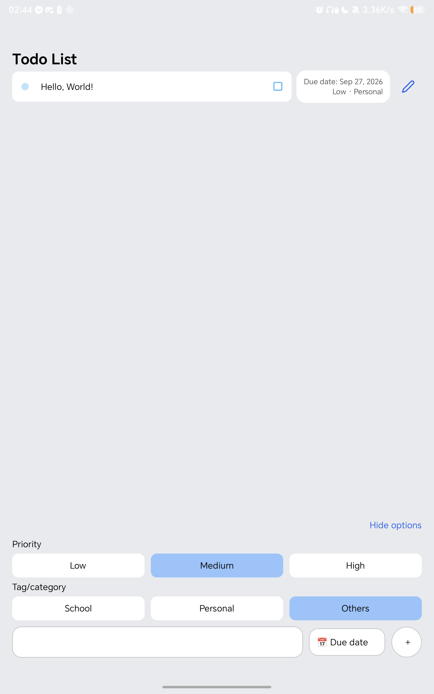
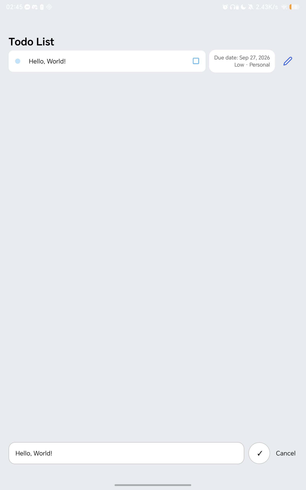

# CMSC 128 Lab 1 — Todo List CRUD

A mobile task manager for creating, viewing, editing, and deleting tasks. Each task has a title, due date, priority, and category. Tasks are saved locally using SQLite.

## Tech stack, backend, and database

| Layer               | Choice                                                                           | Why I chose it                                                                                                                                     |
| ------------------- | -------------------------------------------------------------------------------- | -------------------------------------------------------------------------------------------------------------------------------------------------- |
| Mobile app          | React Native 0.86.3 with Expo SDK 57 and React 19.2.3                            | React Native provides native UI components, while Expo simplifies running and building the app.                                                    |
| Language            | TypeScript                                                                       | Typed task objects help keep the form, task list, and database functions consistent.                                                               |
| Routing and UI      | Expo Router, React Native components, Expo UI date picker, and Expo vector icons | File-based routing provides the entry screen, and the calendar picker makes choosing a due date easier.                                            |
| Backend/data access | Local asynchronous functions in `src/db/database.ts`                             | This single-user app can perform CRUD directly on the device without a server, authentication service, or hosted API.                              |
| Database            | SQLite through `expo-sqlite`                                                     | SQLite provides persistent, structured storage and SQL queries without requiring a database account or an internet connection for data operations. |

The app opens a database named `tasks.db`, creates the `todos` table, and adds missing metadata columns automatically. Data belongs to the local app installation and is not synchronized between devices. No API keys, `.env` file, or separate database setup is required.

## Run the app locally

### Prerequisites

- Git and npm.
- Node.js 22.13.0 or later in the 22.x line, or 24.3.0 or later in the 24.x line, matching the installed React Native package's requirements.
- JDK 17.
- Android Studio with Android SDK Platform 36, Build-Tools 36.0.0, Android SDK Platform-Tools, and NDK 27.1.12297006.
- An Android emulator or Android device with USB debugging enabled. The minimum Android API level is 24.

### 1. Install dependencies

Run these commands in a terminal:

```bash
git clone https://github.com/dejely/cmsc128-Lab1_CRUD_DeAsis.git
cd cmsc128-Lab1_CRUD_DeAsis
npm ci
```

For an existing clone, open the repository root and run `npm ci`. This installs the dependencies from `package-lock.json`.

**Run npm commands from the folder containing `package.json`.** If your terminal is inside `android/`, run `cd ..` first.

### 2. Configure Android

Set `JAVA_HOME` to your JDK 17 installation and `ANDROID_HOME` to your Android SDK installation. Add the JDK's `bin` folder and the SDK's `platform-tools` and `emulator` folders to `PATH`.

For example, on Linux, replace the JDK path below with your actual installation:

```bash
export JAVA_HOME=/path/to/jdk-17
export ANDROID_HOME="$HOME/Android/sdk"
export PATH="$JAVA_HOME/bin:$ANDROID_HOME/platform-tools:$ANDROID_HOME/emulator:$PATH"
```

Start an emulator in Android Studio's Device Manager, or connect your phone/tablet over USB and accept its USB debugging authorization prompt. Check the connection:

```bash
adb devices
```

Your target should appear with status `device`.

### 3. Build and launch

From the repository root:

```bash
npm run android
```

This runs `expo run:android`, generates the native Android project when needed, builds and installs the app, and starts the Metro development server. The first build downloads native dependencies and can take several minutes.

For subsequent sessions with the native app already installed:

```bash
npm start
```

Press `a` in the Expo terminal to open Android. Keep Metro running during development. If a USB-connected device cannot reach Metro, run `adb reverse tcp:8081 tcp:8081` and reopen the app.

`npm run ios` is also defined and requires macOS and Xcode; iOS has not been verified for this README. Although `npm run web` exists, the current Expo UI date picker has no web implementation, so the browser cannot complete the required date-selection step. Use Android for the full CRUD flow.

### 4. Use the app

1. Tap **What needs to be done?** and enter a title. This reveals the task options.
2. Select a priority (**Low**, **Medium**, or **High**) and category (**School**, **Personal**, or **Others**).
3. Tap **Due date** and choose a date from the calendar, then tap **+** to create the task.
4. View the saved task in the list, along with its due date, priority, and category. Database reads order tasks by newest ID first.
5. Tap the pencil icon to edit the title. Tap the check mark to save or **Cancel** to discard the edit.
6. Tap a task card and confirm **Delete**. Tap **UNDO** within three seconds to restore it; otherwise, the database deletion runs after the delay.

New tasks require a nonempty title and a valid due date. The app stores the selected date as an ISO timestamp representing local midnight and displays it as a local calendar date. Editing currently changes only the title. The database has a `completed` field, but the UI does not implement completion toggling.

## Example API/data operations

This app exposes CRUD as TypeScript functions rather than HTTP endpoints. The implementation is in [`src/db/database.ts`](src/db/database.ts), and the task type is in [`src/db/todo.ts`](src/db/todo.ts).

| Operation  | Function                                      | SQL used                                                                                  |
| ---------- | --------------------------------------------- | ----------------------------------------------------------------------------------------- |
| Initialize | `initDatabase()`                              | Create the table if absent and add missing `dueDate`, `priority`, and `category` columns. |
| Create     | `addTodo(title, dueDate, priority, category)` | `INSERT INTO todos (title, dueDate, priority, category) VALUES (?,?,?,?)`                 |
| Read       | `getTodos()`                                  | `SELECT id, title, completed, dueDate, priority, category FROM todos ORDER BY id DESC`    |
| Update     | `updateTodo(id, title)`                       | `UPDATE todos SET title = ? WHERE id = ?`                                                 |
| Delete     | `deleteTodo(id)`                              | `DELETE FROM todos WHERE id = ?`                                                          |

Example calls **inside the running app** (these are not terminal commands):

```ts
import {
  initDatabase,
  addTodo,
  getTodos,
  updateTodo,
  deleteTodo,
} from "@/db/database";

async function demonstrateCrud() {
  await initDatabase();

  // CREATE: SQLite assigns the ID; addTodo returns no record or ID.
  await addTodo(
    "Finish CMSC 128 report",
    new Date("2026-09-15T00:00:00").toISOString(),
    "High",
    "School",
  );

  // READ: run this demo without concurrent inserts so the new task is first.
  const tasks = await getTodos();
  const created = tasks[0];
  if (!created) return;

  // UPDATE: change this demonstration task's title.
  await updateTodo(created.id, "Submit CMSC 128 report");

  // DELETE: direct database calls delete immediately.
  // Confirmation and the three-second undo delay are handled by the UI.
  await deleteTodo(created.id);
}
```

The `todos` table stores an auto-incrementing integer `id`, required text `title`, integer `completed` (default `0`), nullable text `dueDate`, text `priority`, and text `category`. The schema's priority default remains `Med` for legacy rows; the current form explicitly saves `Low`, `Medium`, or `High`. The category default is `Others`. SQL writes bind values through placeholders.

## Screenshots of the working app

Captured from the native Android app running on a connected HONOR tablet.

| Saved task and creation options                                                                                                                                               | Editing a task title                                                                                                                          |
| ----------------------------------------------------------------------------------------------------------------------------------------------------------------------------- | --------------------------------------------------------------------------------------------------------------------------------------------- |
|  |  |

Original images: [task list](docs/screenshots/task-list.png) · [edit form](docs/screenshots/edit-task.png).
